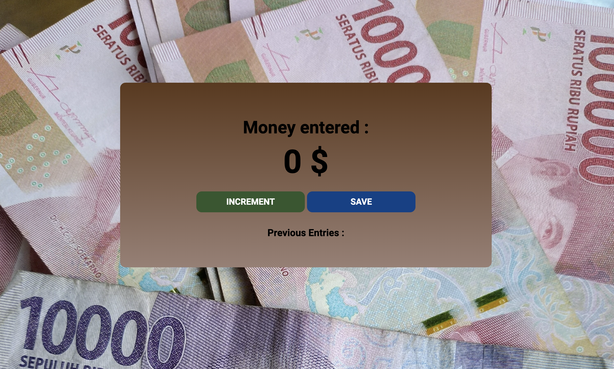

# Passenger counter

## Table of contents

- [Overview](#overview)
  - [The project](#the-challenge)
  - [Screenshot](#screenshot)
  - [Built with](#built-with)
  - [What I learned](#what-i-learned)
  - [Useful resources](#useful-resources)
- [Author](#author)

## Overview

### The project

I've started learning JavaScript, so in this small prject I builded a money counter where I applied the basic JavaScript's concepts that I've learned so far.

### Screenshot

### Built with

- Semantic HTML5
- CSS custom properties
- JavaScript - DOM (Document Object Module)

### What I learned

I focused here on what I've learned in JavaScript so far :

- Script tag
- Variables
- Numbers
- Strings
- console.log()
- Functions
- The DOM
- getElementById()
- innerText
- textContent

### Useful resources

- [Google fonts](https://fonts.google.com/) - This helped me to get suitable fonts for almost all my projects.
- [coolors](https://coolors.co/) - This is an amazing website. I'd recommend it to anyone who's looking for colors paletes.

## Author

- LinkedIn - [Mouad El Asri](https://www.linkedin.com/in/mouad-el-asri/)
- Twitter - [@yourusername](https://www.twitter.com/yourusername)

## Thanks

If you liked this project, don't forget to give it a ⭐.

## Supporting
Many hours of hard work have gone into this project. Your support will be very appreciated!

